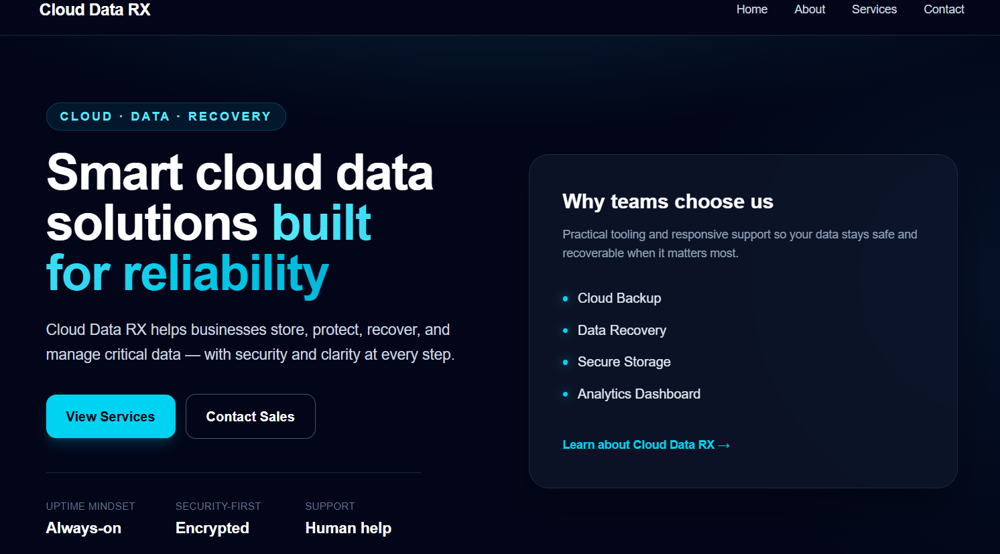
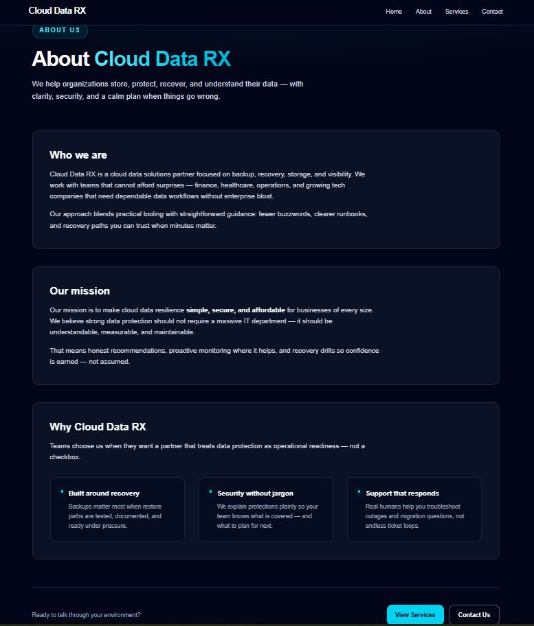
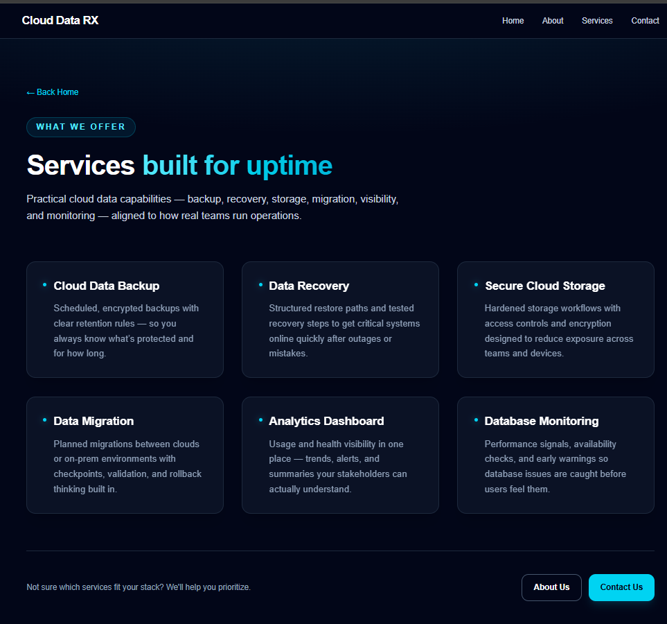
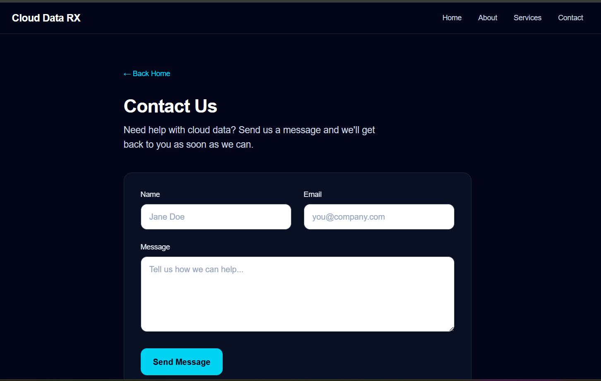

# Cloud Data RX

A simple marketing-style website for **Cloud Data RX**, built with **Next.js**. It showcases cloud backup, recovery, storage, and related services with a responsive layout.


## Project description

Cloud Data RX is a beginner-friendly Next.js project that presents a small business website:

- A bold **home hero** with calls-to-action  
- **About**, **Services**, and **Contact** pages  
- A shared **navigation bar** and **footer** on every page  
- A **contact form** that validates in the browser (demo only — no server saves emails yet)

## Features

- **Responsive design** — Works on phones, tablets, and desktops  
- **Shared layout** — Navbar + footer wrap all routes (`app/layout.tsx`)  
- **Dark UI with cyan accents** — Consistent look across pages  
- **Services grid** — Six services with short descriptions  
- **About page** — Sections for who we are, mission, and why Cloud Data RX  
- **Contact form** — Controlled inputs, validation, success alert, and reset after submit (demo)


## Tech stack

| Tool | Purpose |
|------|---------|
| **Next.js** (`App Router`) | Framework and routing |
| **React** | UI components |
| **TypeScript** | Typed JavaScript |
| **Tailwind CSS** | Styling |
| **ESLint** | Code linting |

Versions depend on your `package.json` (example: Next.js 16.x, React 19.x).


## Folder structure (simple overview)

cloud-data-rx/
├── app/
│   ├── about/
│   │   └── page.tsx          → /about
│   ├── contact/
│   │   └── page.tsx          → /contact (client form)
│   ├── services/
│   │   └── page.tsx          → /services
│   ├── components/
│   │   ├── SiteHeader.tsx    → Navbar (mobile menu)
│   │   └── SiteFooter.tsx    → Footer component file
│   ├── favicon.ico
│   ├── globals.css           → Global styles + Tailwind
│   ├── layout.tsx            → Root layout (fonts, navbar, footer)
│   └── page.tsx              → Home page (/)
├── public/                   → Static files (images, etc.)
├── package.json
├── next.config.ts
├── postcss.config.mjs
├── eslint.config.mjs
├── tsconfig.json
└── README.md
```

**Note:** The footer you see on the site is defined in `app/layout.tsx`. The `SiteFooter.tsx` file is an extra component in the repo—you can reuse it or clean it up later if you prefer one approach only.

**Tip:** In Next.js App Router, each folder under `app/` with a `page.tsx` file becomes a **route**.


## How to run the project

### 1. Install dependencies

From the project folder:

npm install

### 2. Start the dev server

npm run dev

Open **[http://localhost:3000](http://localhost:3000)** in your browser.

### 3. Other useful commands

npm run build   # Create a production build
npm run start   # Run the production server (after build)
npm run lint    # Run ESLint


## Pages included

| Route | File | What it shows |
|-------|------|----------------|
| `/` | `app/page.tsx` | Home hero and highlights |
| `/about` | `app/about/page.tsx` | About sections |
| `/services` | `app/services/page.tsx` | Service cards |
| `/contact` | `app/contact/page.tsx` | Contact form (validated; demo submit) |

Navigation links and footer links match these routes.


## Future improvements

Ideas you can add as you learn more:

- **Save contact messages** — Use a **Route Handler** (`app/api/...`) or **Server Action** to receive form data  
- **Email or CRM** — Send messages with Resend, SendGrid, or similar  
- **Tests** — Add Playwright or Vitest for critical flows  
- **Blog or docs** — New routes under `app/`  
- **Better SEO** — Per-page titles/descriptions with Next.js `metadata`  
- **Analytics** — Privacy-friendly visitor stats  
- **Deploy** — Host on [Vercel](https://vercel.com) or another platform  


## Learn more

- [Next.js Documentation](https://nextjs.org/docs)  
- [Tailwind CSS Documentation](https://tailwindcss.com/docs)  

## 📸 Screenshots

### Home Page


### About Page


### Services Page


### Contact Page



